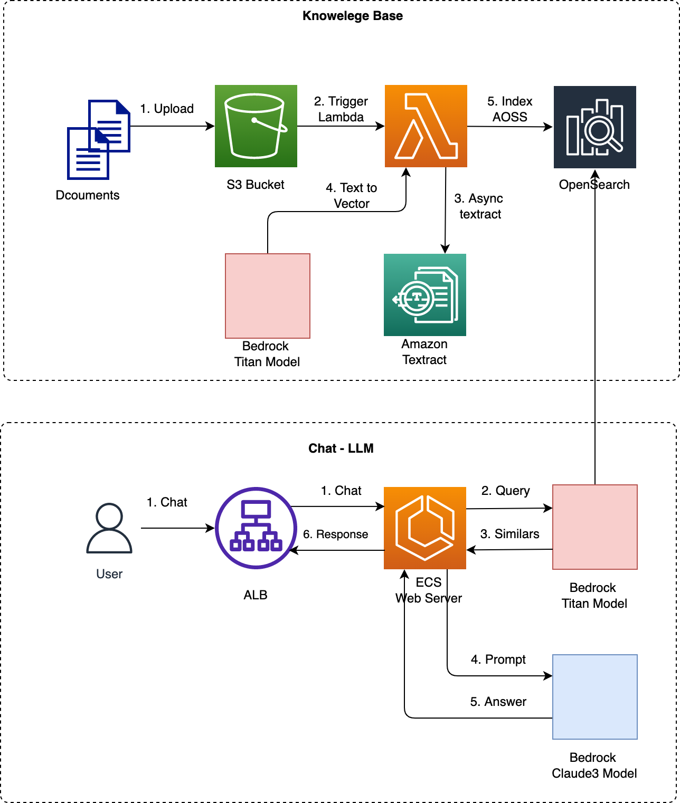

# Developing GenAI Applications with Golang

## Prerequisite

This sample application assumes that you already setup

- Permissions to invoke Claude 3 Haiku model on Amazon Bedrock
- You setup a knowledge base as architecture in RAG section
- You launch an AWS maanged knowledge base
- Permissions to invoke Amazon OpenSearch Serverless (AOSS) Collection and the managed knowledge base

Please replace variables in /bedrock/constants.go with yours, for example

```go
const BEDROCK_REGION = ""
const AOSS_REGION = ""
const KNOWLEDGE_BASE_REGION = ""
const KNOWLEDGE_BASE_ID = ""
const KNOWLEDGE_BASE_MODEL_ID = ""
const KNOWLEDGE_BASE_NUMBER_OF_RESULT = 6
const AOSS_ENDPOINT = ""
```

## Introduction

What we often see in production is a variety on languages written in Go, Java, .Net, however the majority of learning material on building GenAI (Generative Artifical Intelligence) apps currently is in Python and JavaScript. This workshop shows how to get started with Amazon Bedrock in Go through implementing few basic examples without using frameworks like Langchain, Streamlit or React.

Examples include:

- Simple chat and prompt
- Simple image analyser
- Query vector database
- Simple RAG (Retrieval Augmented Generation) application

You will implement these features using only basic programing concepts without having to learn a new framework to help you really understand and master fundamental concepts.

- Stream response
- Message API of Anthropic Claude 3 Model
- Prompting Claude 3 on Amazon Bedrock

## Application

Project structure

```go
|--static
  |--claude-haiku.html
  |--claude2.html
  |--image.html
  |--opensearch.html
  |--rag.html
|--bedrock
  |--aoss.go
  |--bedrock.go
  |--constants.go
  |--rag.go
  |--knowledge-based.go
|--main.go
|--build.py
|--Dockerfile
```

main.go implement a http server and route request to handlers. bedrock.go and aoss.go are functions to invoke Amazon Bedrock and Amazon OpenSearch Serverless (AOSS), respecitively. static folder contains simple frontend with javascript.

> [!IMPORTANT]  
> To use AOSS, you need create a OpenSearch collection and provide its URL endpoint in constants.go. In addition, you need to setup data access in the AOSS for the running time environment (EC2 profile, ECS taks role, Lambda role, .etc)

## How to Run

Follow [this official document](https://go.dev/doc/install) to install golang, then run the applicationn as the following

```go
cd developing-genai-applications-with-golang
go run main.go
```

## Streaming Response

First it is good to create some data structs according to [Amazon Bedrock Claude3 API format]()

```go
type Content struct {
	Type string `json:"type"`
	Text string `json:"text"`
}

type Message struct {
	Role    string    `json:"role"`
	Content []Content `json:"content"`
}

type Body struct {
	MaxTokensToSample int       `json:"max_tokens"`
	Temperature       float64   `json:"temperature,omitempty"`
	AnthropicVersion  string    `json:"anthropic_version"`
	Messages          []Message `json:"messages"`
}

// list of messages
messages := []Message{{
	Role:    "user",
	Content: []Content{{Type: "text", Text: promt}},
}}

// form request body
payload := Body{
	MaxTokensToSample: 2048,
	Temperature:       0.9,
	AnthropicVersion:  "bedrock-2023-05-31",
	Messages:          messages,
}
```

Then convert the payload to bytes and invoke Bedrock client

```go
payload := Body{
	MaxTokensToSample: 2048,
	Temperature:       0.9,
	AnthropicVersion:  "bedrock-2023-05-31",
	Messages:          messages,
}

// marshal payload to bytes
payloadBytes, err := json.Marshal(payload)

if err != nil {
	fmt.Println(err)
	return
}

// create request to bedrock
output, error := BedrockClient.InvokeModelWithResponseStream(
	context.Background(),
	&bedrockruntime.InvokeModelWithResponseStreamInput{
		Body:        payloadBytes,
		ModelId:     aws.String("anthropic.claude-3-haiku-20240307-v1:0"),
		ContentType: aws.String("application/json"),
		Accept:      aws.String("application/json"),
	},
)

if error != nil {
	fmt.Println(error)
	return
}
```

Finally, parse the streaming reponse and decode to text. When deploy on a http server, we need to modify the code a bit to stream each chunk of response to client. For example [HERE]()

```go
output, error := BedrockClient.InvokeModelWithResponseStream(
	context.Background(),
	&bedrockruntime.InvokeModelWithResponseStreamInput{
		Body:        payloadBytes,
		ModelId:     aws.String("anthropic.claude-3-haiku-20240307-v1:0"),
		ContentType: aws.String("application/json"),
		Accept:      aws.String("application/json"),
	},
)

if error != nil {
	fmt.Println(error)
	return
}

// parse response stream
for event := range output.GetStream().Events() {
	switch v := event.(type) {
	case *types.ResponseStreamMemberChunk:

		//fmt.Println("payload", string(v.Value.Bytes))

		var resp ResponseClaude3
		err := json.NewDecoder(bytes.NewReader(v.Value.Bytes)).Decode(&resp)
		if err != nil {
			fmt.Println(err)
		}

		fmt.Println(resp.Delta.Text)

	case *types.UnknownUnionMember:
		fmt.Println("unknown tag:", v.Tag)

	default:
		fmt.Println("union is nil or unknown type")
	}
}
```

## Retrival Augmented Generation

There are two options to build a RAG application either using AWS managed knowledge base or setting up a knowledge base yourself.

First option, you can build a knowlege based as the following architecture



Then we can implement a simple RAG consisting of two basic steps below. Details implementation are shown in rag.go file

- Get context by query the database vector
- Based on the context build a prompt to the llm model

Second option, we can easily launch a knowledge base in Amazon Bedrock console, then use the Bedrock agent runtime to call retrieve or retrieve and generate APIs. Details implementation is shown in knowledge-based.go file. Under the hood, AWS creates a vector database upto your choices such as Amazon OpenSearch Serverless (AOSS) or Amazon Aurora (postgresql engine).
