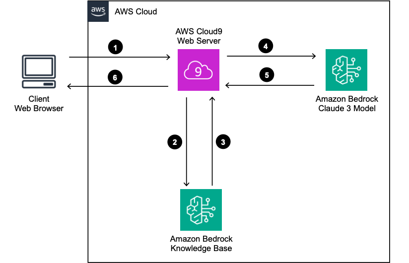
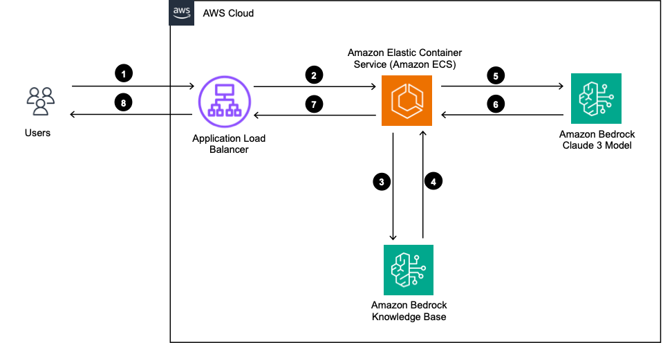

# Developing GenAI Applications with Golang

## Introduction

What we often see in production is a variety on languages written in Go, Java, .Net, however the majority of learning material on building GenAI (Generative Artifical Intelligence) apps currently is in Python and JavaScript. This workshop shows how to get started with Amazon Bedrock in Go through implementing few basic examples without using frameworks like Langchain, Streamlit or React.

Examples include:

- Simple chat and prompt
- Simple image analyser
- Query vector database
- Simple RAG (Retrieval Augmented Generation) application

You will implement these features using only basic programing concepts without having to learn a new framework to help you really understand and master fundamental concepts.

- Stream response
- Message API of Anthropic Claude 3 Model
- Prompting Claude 3 on Amazon Bedrock

Architecture



## Prerequisites

This sample application assumes that you already setup

- Permissions to invoke Claude 3 Haiku model on Amazon Bedrock
- You launch an AWS maanged knowledge base
- Permissions to invoke Amazon OpenSearch Serverless (AOSS) Collection and the managed knowledge base

Please replace variables in /bedrock/constants.go with yours, for example

```go
const BEDROCK_REGION = ""
const AOSS_REGION = ""
const KNOWLEDGE_BASE_REGION = ""
const KNOWLEDGE_BASE_ID = ""
const KNOWLEDGE_BASE_MODEL_ID = ""
const KNOWLEDGE_BASE_NUMBER_OF_RESULT = 6
const AOSS_ENDPOINT = ""
const AOSS_NOTE_APP_INDEX_NAME = ""
```

## Application

Project structure

```go
|--static
  |--aoss-index.html
  |--aoss-query.html
  |--claude-haiku.html
  |--image.html
  |--retrieve.html
  |--retrieve-generate.html
|--bedrock
  |--aoss.go
  |--bedrock.go
  |--constants.go
  |--knowledge-based.go
|--main.go
|--go.mod
|--go.sum
```

main.go implement a http server and route request to handlers. bedrock.go and aoss.go are functions to invoke Amazon Bedrock and Amazon OpenSearch Serverless (AOSS), respecitively. static folder contains simple frontend with javascript.

> [!IMPORTANT]  
> To use AOSS, you need create a OpenSearch collection and provide its URL endpoint in constants.go. In addition, you need to setup data access in the AOSS for the running time environment (EC2 profile, ECS taks role, Lambda role, .etc)

## How to Run

Follow [this official document](https://go.dev/doc/install) to install golang, then run the applicationn as the following

> [!IMPORTANT]  
> Please install Go version 1.21.5

```go
cd developing-genai-applications-with-golang
go run main.go
```

## Streaming Response

First it is good to create some data structs according to [Amazon Bedrock Claude3 API format]()

```go
type Content struct {
	Type string `json:"type"`
	Text string `json:"text"`
}

type Message struct {
	Role    string    `json:"role"`
	Content []Content `json:"content"`
}

type Body struct {
	MaxTokensToSample int       `json:"max_tokens"`
	Temperature       float64   `json:"temperature,omitempty"`
	AnthropicVersion  string    `json:"anthropic_version"`
	Messages          []Message `json:"messages"`
}

// list of messages
messages := []Message{{
	Role:    "user",
	Content: []Content{{Type: "text", Text: promt}},
}}

// form request body
payload := Body{
	MaxTokensToSample: 2048,
	Temperature:       0.9,
	AnthropicVersion:  "bedrock-2023-05-31",
	Messages:          messages,
}
```

Then convert the payload to bytes and invoke Bedrock client

```go
payload := Body{
	MaxTokensToSample: 2048,
	Temperature:       0.9,
	AnthropicVersion:  "bedrock-2023-05-31",
	Messages:          messages,
}

// marshal payload to bytes
payloadBytes, err := json.Marshal(payload)

if err != nil {
	fmt.Println(err)
	return
}

// create request to bedrock
output, error := BedrockClient.InvokeModelWithResponseStream(
	context.Background(),
	&bedrockruntime.InvokeModelWithResponseStreamInput{
		Body:        payloadBytes,
		ModelId:     aws.String("anthropic.claude-3-haiku-20240307-v1:0"),
		ContentType: aws.String("application/json"),
		Accept:      aws.String("application/json"),
	},
)

if error != nil {
	fmt.Println(error)
	return
}
```

Finally, parse the streaming reponse and decode to text. When deploy on a http server, we need to modify the code a bit to stream each chunk of response to client. For example [HERE]()

```go
output, error := BedrockClient.InvokeModelWithResponseStream(
	context.Background(),
	&bedrockruntime.InvokeModelWithResponseStreamInput{
		Body:        payloadBytes,
		ModelId:     aws.String("anthropic.claude-3-haiku-20240307-v1:0"),
		ContentType: aws.String("application/json"),
		Accept:      aws.String("application/json"),
	},
)

if error != nil {
	fmt.Println(error)
	return
}

// parse response stream
for event := range output.GetStream().Events() {
	switch v := event.(type) {
	case *types.ResponseStreamMemberChunk:

		//fmt.Println("payload", string(v.Value.Bytes))

		var resp ResponseClaude3
		err := json.NewDecoder(bytes.NewReader(v.Value.Bytes)).Decode(&resp)
		if err != nil {
			fmt.Println(err)
		}

		fmt.Println(resp.Delta.Text)

	case *types.UnknownUnionMember:
		fmt.Println("unknown tag:", v.Tag)

	default:
		fmt.Println("union is nil or unknown type")
	}
}
```

## Deployment

This workshop does not provide detailed step by step to deploy the application. Instead, it provides overall architecture and a deployment option. It is straightfoward to deploy the application on Amazon ECS.



1. Users ask a question.
2. The Application Load Balancer distributes the request to Amazon ECS tasks.
3. The ECS tasks query the knowledge base.
4. The ECS tasks receive vectors and text chunks that are relevant to the user's question.
5. The ECS tasks build and send the prompt to the Claude 3 Model on Amazon Bedrock.
6. Amazon Bedrock streams the response to the ECS tasks.
7. The ECS tasks stream the response to the Application Load Balancer.
8. The Application Load Balancer forwards the response to the users.

**Dockerfile**

```go
# syntax=docker/dockerfile:1

# Build the application from source
FROM golang:1.21.5 AS build-stage

WORKDIR /app

COPY go.mod go.sum ./
RUN go mod download

COPY *.go ./
COPY  bedrock ./bedrock

RUN CGO_ENABLED=0 GOOS=linux go build -o /genaiapp

# Run the tests in the container
FROM build-stage AS run-test-stage

# Deploy the application binary into a lean image
FROM gcr.io/distroless/base-debian11 AS build-release-stage

WORKDIR /

COPY --from=build-stage /genai-go-app /genaiapp
COPY static ./static

EXPOSE 3000

USER nonroot:nonroot

ENTRYPOINT ["/genaiapp"]
```

**ECS Task Role**

The task role need permissions to

- Invoke Amazon Bedrock Runtime
- Invoke Amazon Bedrock Agent Runtime
- Access to Claude 3 and Titan models
- Upload data to the S3 bucket in knowledge base
- Access the AOSS collection

Here is a sample of IAM policy attached to the task role

```json
{
  "Version": "2012-10-17",
  "Statement": [
    {
      "Action": [
        "bedrock:InvokeModel",
        "bedrock:InvokeModelWithResponseStream",
        "bedrock:InvokeAgent"
      ],
      "Resource": [
        "arn:aws:bedrock:<REGION>::foundation-model/anthropic.claude-3-haiku-20240307-v1:0",
        "arn:aws:bedrock:<REGION>::foundation-model/amazon.titan-embed-text-v1"
      ],
      "Effect": "Allow"
    },
    {
      "Action": ["s3:GetObject", "s3:PutObject"],
      "Resource": [
        "arn:aws:s3:::<BUCKET_NAME>",
        "arn:aws:s3:::<BUCKET_NAME>/*"
      ],
      "Effect": "Allow"
    },
    {
      "Action": "aoss:APIAccessAll",
      "Resource": [
        "arn:aws:aoss:<REGION>:<ACCOUNT_ID>:collection/<COLLECTION_ID>"
      ],
      "Effect": "Allow"
    }
  ]
}
```

**AOSS Data Access Policy**

To allow the task role to access the AOSS collection, we need to update the Access Policy of the collection.
