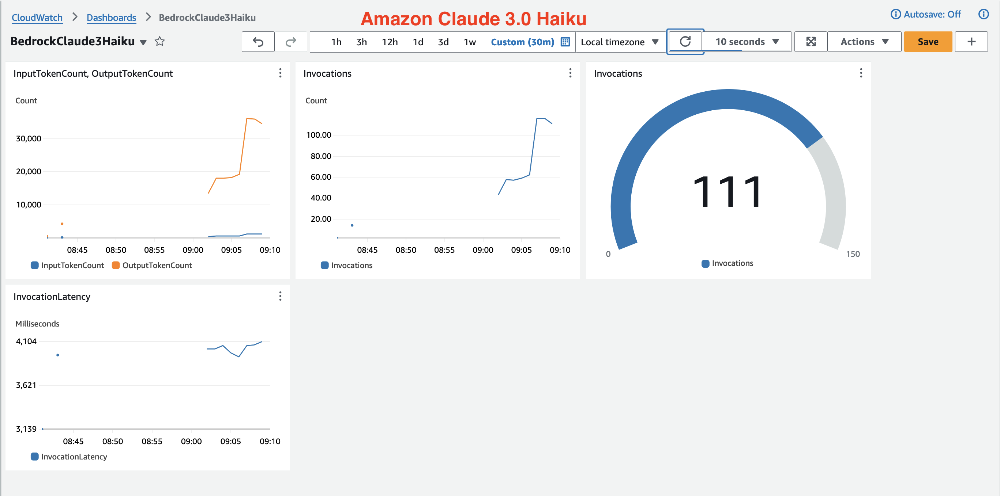

## Create Dashboard

Let create a dashboard in CloudWatch for monitoring:

- token input per minute
- token output per minute
- invocation per minute
- throttling exception per minute
- average invocation latency

Run the following script to create the dashboard. Please update <DASHBOARD_NAME> and <MODEL_ID> to your requirement.

```bash
python create-dashboard.py
```

Dashboard to monitor performance of Amazon Claude 3.5 Sonnet.


Dashboard to monitor performance of Amazon Claude 3.0 Haiku.


## Simple Load Test

Let run a simple test script using multiple thread. There are two simple variables, please update it as your requirement.

- NUM_THREAD simulates number of concurrent user
- SLEEP_TIME simulates period between request of a user

Run the load test script and monitor the created dashboard above.

```bash
python simple-load-test.py
```

## CloudWatch LogInsights Query

```sql
--
fields @timestamp, modelId, requestId, accountId, inferenceRegion,errorCode, @message
| filter errorCode = "ThrottlingException"
| sort @timestamp desc
| limit 10000


--
fields @timestamp, errorCode, modelId, requestId, accountId, inferenceRegion, @message
| filter @message like /ThrottlingException/
| sort @timestamp desc
| limit 10000


--
fields @timestamp, modelId, requestId, accountId, inferenceRegion, output.outputBodyJson.metrics.latencyMs as latency, input.inputTokenCount, output.outputBodyJson.usage.outputTokens, @message
| filter ispresent(output.outputBodyJson.metrics.latencyMs)
| sort latency desc
| limit 10000
```

## Reference

[Boto3 Bedrock Converse API](https://boto3.amazonaws.com/v1/documentation/api/latest/reference/services/bedrock-runtime/client/converse.html)

[Monitoring Generative AI Applications Using Amazon Bedrock and Amazon Cloudwatch Integration/](https://aws.amazon.com/blogs/mt/monitoring-generative-ai-applications-using-amazon-bedrock-and-amazon-cloudwatch-integration/)

[Reduce Costs and Latency with Amazon Bedrock Intelligent Prompt Routing and Prompt Caching Preview/](https://aws.amazon.com/blogs/aws/reduce-costs-and-latency-with-amazon-bedrock-intelligent-prompt-routing-and-prompt-caching-preview/)

[Optimizing AI Responsiveness a Practical Guide to Amazon Bedrock Latency Optimized Inference](https://aws.amazon.com/blogs/machine-learning/optimizing-ai-responsiveness-a-practical-guide-to-amazon-bedrock-latency-optimized-inference/)
