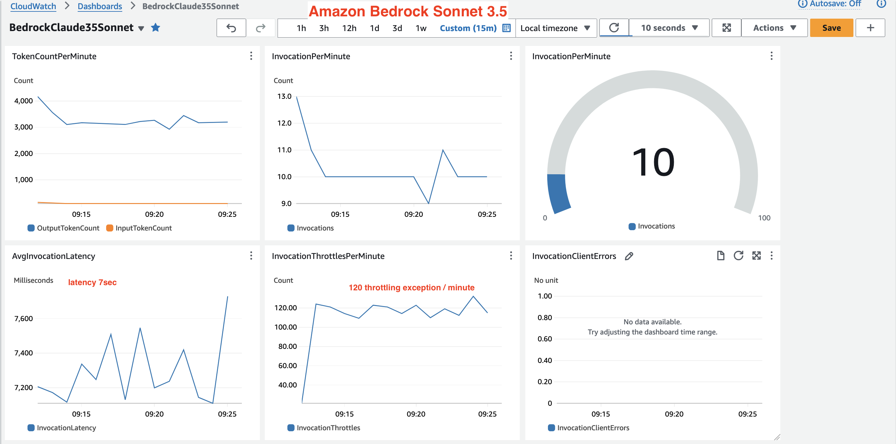

## Create Dashboard

Let create a dashboard in CloudWatch for monitoring:

- token input per minute
- token output per minute
- invocation per minute
- throttling exception per minute
- average invocation latency

Run the following script to create the dashboard. Please update <DASHBOARD_NAME> and <MODEL_ID> to your requirement.

```bash
python create-dashboard.py
```

Dashboard to monitor performance of Amazon Claude 3.5 Sonnet. 



Dashboard to monitor performance of Amazon Claude 3.0 Haiku. 


## Simple Load Test

Let run a simple test script using multiple thread. There are two simple variables, please update it as your requirement.

- NUM_THREAD simulates number of concurrent user
- SLEEP_TIME simulates period between request of a user

Run the load test script and monitor the created dashboard above.

```bash
python simple-load-test.py
```
